# 🏗️ Architecture Documentation - Gemini AI Blog

Comprehensive technical architecture documentation for the Gemini AI Blog platform.

## 📋 Table of Contents

- [🌟 System Overview](#-system-overview)
- [🏗️ Architecture Layers](#️-architecture-layers)
- [🔧 Technology Stack](#-technology-stack)
- [📊 Data Flow](#-data-flow)
- [🔐 Security Architecture](#-security-architecture)
- [🚀 Performance Architecture](#-performance-architecture)
- [📱 Frontend Architecture](#-frontend-architecture)
- [🔌 Backend Architecture](#-backend-architecture)
- [🗄️ Database Architecture](#️-database-architecture)
- [🤖 AI Integration Architecture](#ai-integration-architecture)
- [📈 Scalability Architecture](#-scalability-architecture)

---

## 🌟 System Overview

### High-Level Architecture

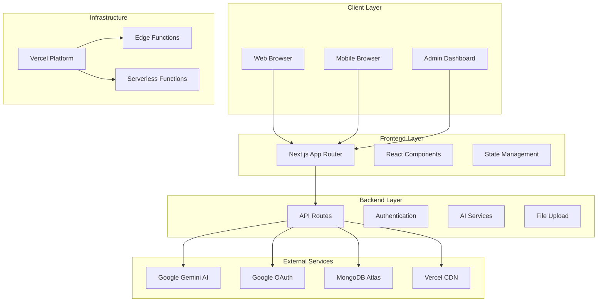

### System Components

| Component | Technology | Purpose |
|-----------|------------|---------|
| **Frontend** | Next.js 15, React 18, TypeScript | User interface and client-side logic |
| **Backend** | Next.js API Routes, Node.js | Server-side logic and API endpoints |
| **Database** | MongoDB Atlas | Data persistence and storage |
| **Authentication** | NextAuth.js | User authentication and session management |
| **AI Services** | Google Gemini AI | Content generation and moderation |
| **Deployment** | Vercel | Hosting and CDN |
| **Styling** | Tailwind CSS | Responsive design and styling |

---

## 🏗️ Architecture Layers

### Layer Architecture

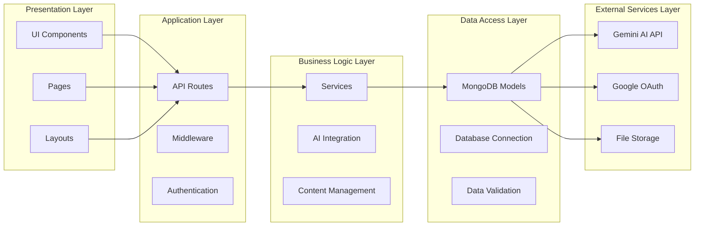

### Layer Responsibilities

#### Presentation Layer
- **UI Components**: Reusable React components
- **Pages**: Next.js page components
- **Layouts**: Page layouts and navigation

#### Application Layer
- **API Routes**: RESTful API endpoints
- **Middleware**: Request/response processing
- **Authentication**: User authentication logic

#### Business Logic Layer
- **Services**: Core business logic
- **AI Integration**: Gemini AI service integration
- **Content Management**: Blog and user management

#### Data Access Layer
- **MongoDB Models**: Database schemas and models
- **Database Connection**: MongoDB connection management
- **Data Validation**: Input validation and sanitization

#### External Services Layer
- **Gemini AI API**: AI content generation
- **Google OAuth**: Authentication provider
- **File Storage**: Image and file storage

---

## 🔧 Technology Stack

### Frontend Technologies

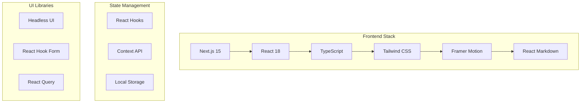

### Backend Technologies

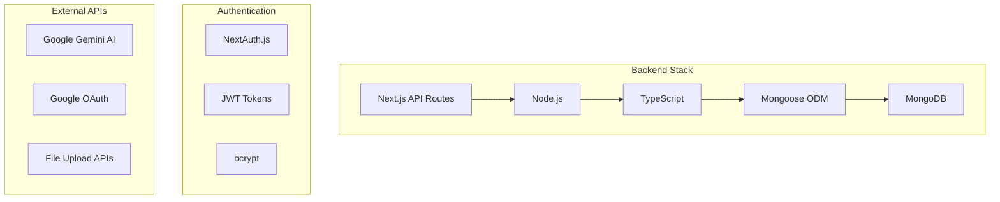

### Development Tools

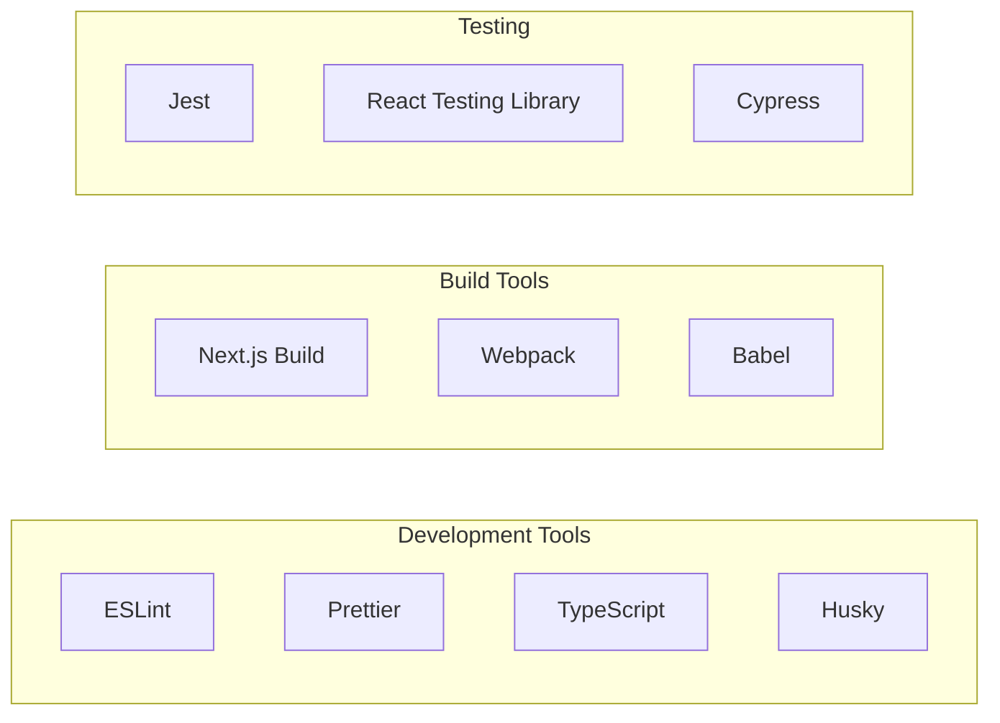

---

## 📊 Data Flow

### User Authentication Flow

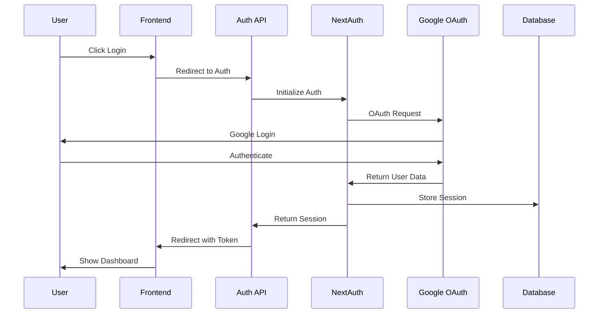

### Blog Creation Flow

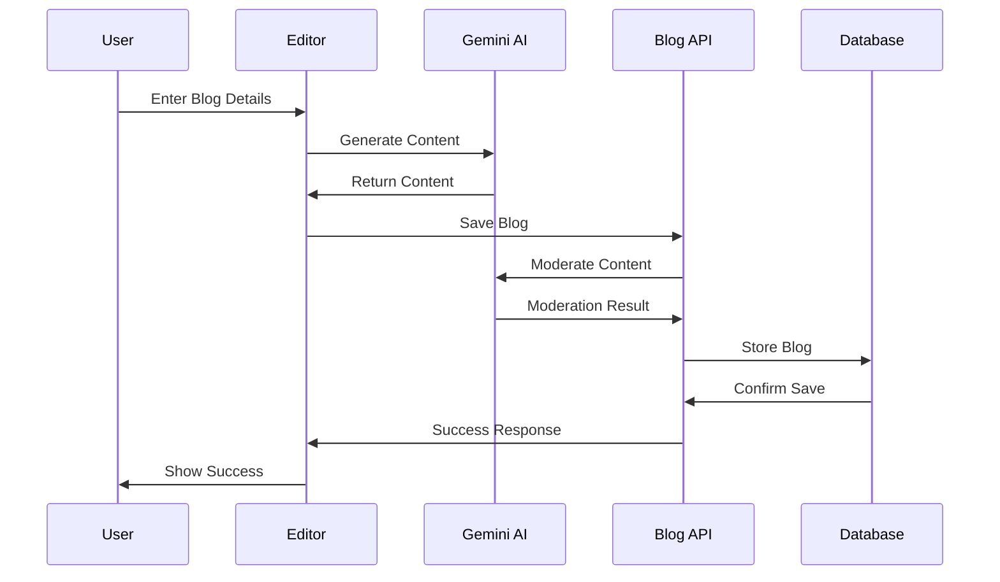

### AI Chat Flow

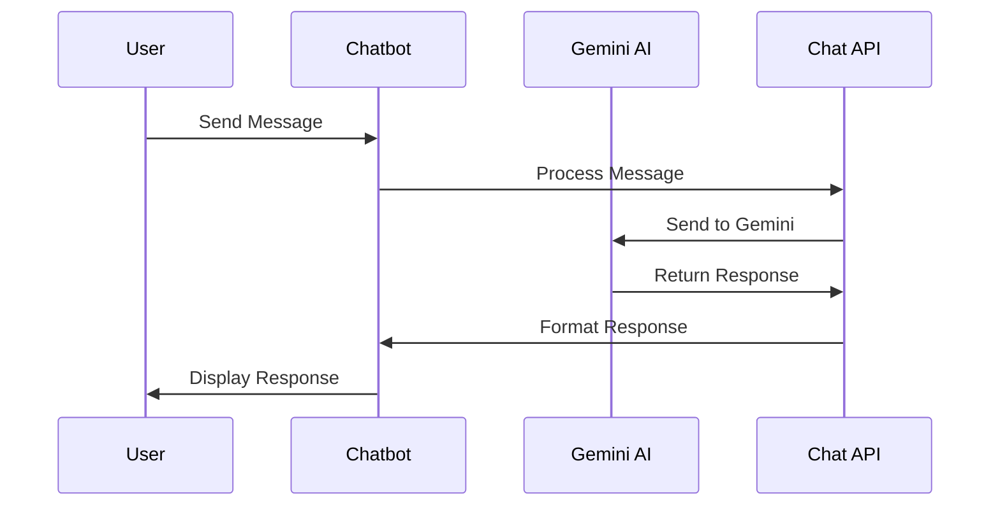

---

## 🔐 Security Architecture

### Security Layers

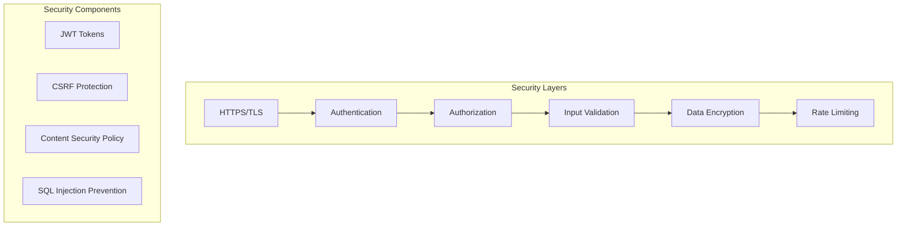

### Authentication Architecture

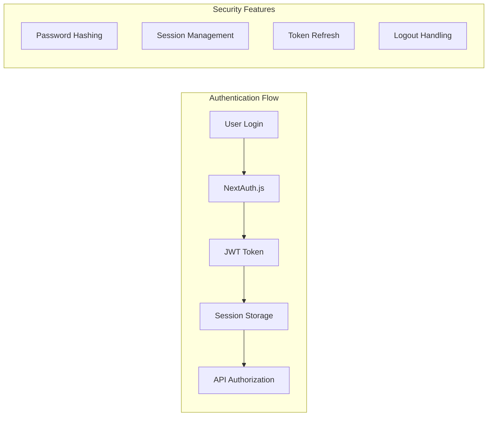

### Authorization Model

```typescript
// Role-based access control
interface User {
  id: string;
  name: string;
  email: string;
  role: 'admin' | 'editor' | 'reader';
  permissions: Permission[];
}

interface Permission {
  resource: string;
  actions: string[];
}

// Permission matrix
const permissions = {
  admin: ['read', 'write', 'delete', 'manage_users'],
  editor: ['read', 'write'],
  reader: ['read']
};
```

---

## 🚀 Performance Architecture

### Performance Optimization

```mermaid
graph TB
    subgraph "Frontend Performance"
        A[Code Splitting] --> B[Lazy Loading]
        B --> C[Image Optimization]
        C --> D[Bundle Optimization]
    end
    
    subgraph "Backend Performance"
        E[Caching] --> F[Database Indexing]
        F --> G[API Optimization]
        G --> H[CDN]
    end
    
    subgraph "Infrastructure Performance"
        I[Edge Functions] --> J[Serverless]
        J --> K[Auto Scaling]
        K --> L[Load Balancing]
    end
```

### Caching Strategy

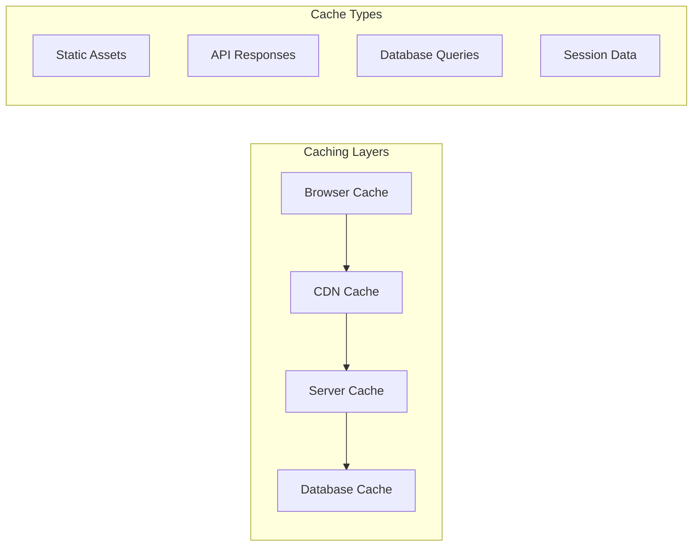

### Performance Metrics

| Metric | Target | Monitoring |
|--------|--------|------------|
| **Page Load Time** | < 2s | Core Web Vitals |
| **Time to Interactive** | < 3s | Lighthouse |
| **API Response Time** | < 500ms | Custom Metrics |
| **Database Query Time** | < 100ms | MongoDB Atlas |
| **Image Load Time** | < 1s | Image Optimization |

---

## 📱 Frontend Architecture

### Component Architecture

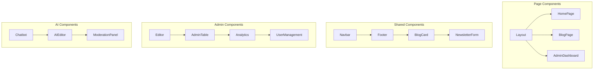

### State Management

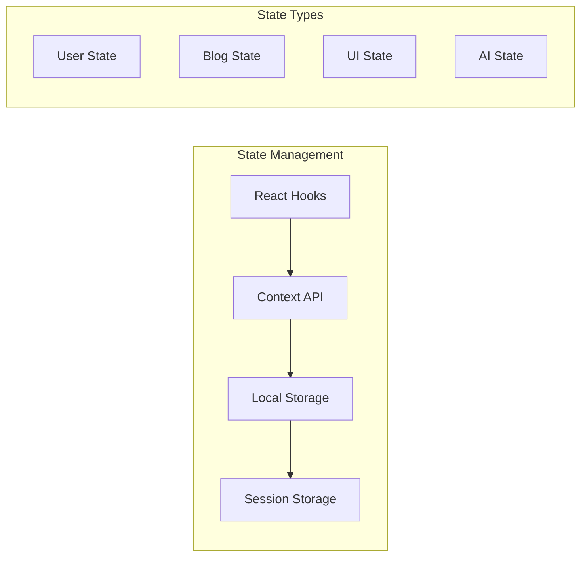

### Routing Architecture

```typescript
// Next.js App Router Structure
app/
├── (admin)/           # Admin route group
│   └── dashboard/     # Admin dashboard
├── (auth)/            # Auth route group
│   ├── login/         # Login page
│   └── register/      # Register page
├── (blog)/            # Blog route group
│   └── blog/          # Blog pages
├── api/               # API routes
│   ├── ai/            # AI endpoints
│   ├── auth/          # Auth endpoints
│   └── blog/          # Blog endpoints
└── layout.tsx         # Root layout
```

---

## 🔌 Backend Architecture

### API Architecture

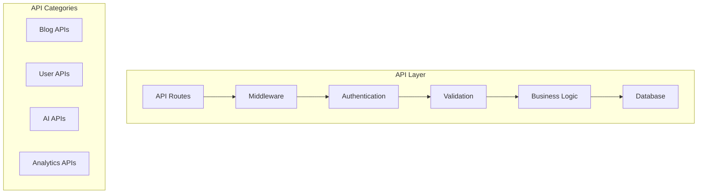

### Middleware Architecture

```typescript
// Middleware chain
export function middleware(request: NextRequest) {
  // 1. Authentication check
  const token = request.headers.get('authorization');
  
  // 2. Rate limiting
  const rateLimit = checkRateLimit(request);
  
  // 3. CORS handling
  const corsHeaders = handleCORS(request);
  
  // 4. Request logging
  logRequest(request);
  
  return NextResponse.next({
    headers: corsHeaders
  });
}
```

### Error Handling

```typescript
// Global error handling
export async function errorHandler(error: Error, req: Request) {
  // Log error
  console.error('API Error:', error);
  
  // Return appropriate response
  return NextResponse.json({
    success: false,
    error: error.message,
    code: getErrorCode(error),
    timestamp: new Date().toISOString()
  }, { status: getErrorStatus(error) });
}
```

---

## 🗄️ Database Architecture

### Database Schema

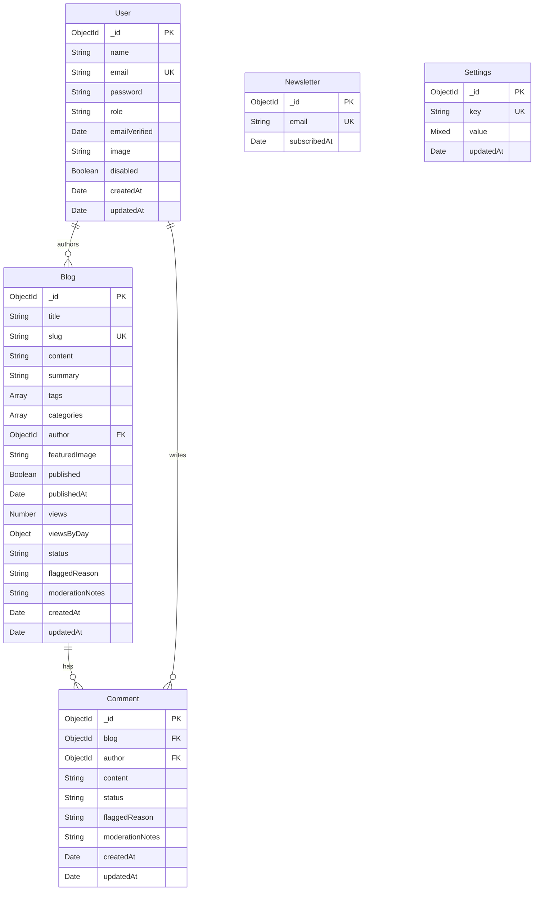

### Database Indexing

```javascript
// MongoDB Indexes
// Users collection
db.users.createIndex({ "email": 1 }, { unique: true });
db.users.createIndex({ "role": 1 });
db.users.createIndex({ "disabled": 1 });

// Blogs collection
db.blogs.createIndex({ "slug": 1 }, { unique: true });
db.blogs.createIndex({ "published": 1, "createdAt": -1 });
db.blogs.createIndex({ "author": 1 });
db.blogs.createIndex({ "tags": 1 });
db.blogs.createIndex({ "status": 1 });

// Comments collection
db.comments.createIndex({ "blog": 1 });
db.comments.createIndex({ "author": 1 });
db.comments.createIndex({ "status": 1 });

// Newsletter collection
db.newsletter.createIndex({ "email": 1 }, { unique: true });
```

### Data Access Patterns

```typescript
// Repository pattern for data access
class BlogRepository {
  async findPublished(page: number, limit: number) {
    return await Blog.find({ published: true })
      .sort({ createdAt: -1 })
      .skip((page - 1) * limit)
      .limit(limit)
      .populate('author', 'name email image');
  }
  
  async findBySlug(slug: string) {
    return await Blog.findOne({ slug })
      .populate('author', 'name email image');
  }
  
  async create(blogData: BlogInput) {
    const blog = new Blog(blogData);
    return await blog.save();
  }
}
```

---

## 🤖 AI Integration Architecture

### AI Service Architecture

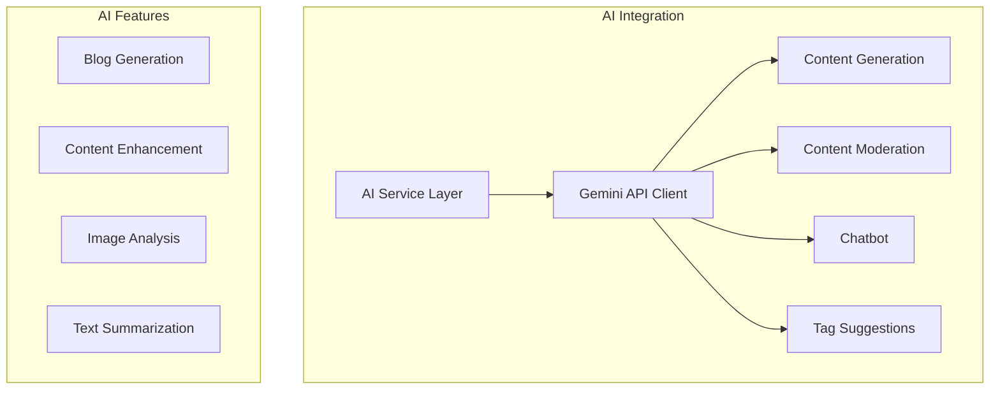

### AI Service Implementation

```typescript
// AI Service class
class GeminiAIService {
  private apiKey: string;
  private baseUrl: string;
  
  constructor() {
    this.apiKey = process.env.GEMINI_API_KEY;
    this.baseUrl = 'https://generativelanguage.googleapis.com/v1beta';
  }
  
  async generateBlog(title: string, keywords?: string) {
    const prompt = this.buildBlogPrompt(title, keywords);
    const response = await this.callGeminiAPI(prompt);
    return this.parseBlogResponse(response);
  }
  
  async moderateContent(content: string) {
    const prompt = this.buildModerationPrompt(content);
    const response = await this.callGeminiAPI(prompt);
    return this.parseModerationResponse(response);
  }
  
  private async callGeminiAPI(prompt: string) {
    const response = await fetch(
      `${this.baseUrl}/models/gemini-pro:generateContent?key=${this.apiKey}`,
      {
        method: 'POST',
        headers: { 'Content-Type': 'application/json' },
        body: JSON.stringify({ contents: [{ parts: [{ text: prompt }] }] })
      }
    );
    return response.json();
  }
}
```

### AI Prompt Engineering

```typescript
// Prompt templates
const PROMPTS = {
  blogGeneration: `
    Generate a detailed, SEO-optimized blog post.
    Title: {title}
    Keywords: {keywords}
    
    Return JSON with fields:
    - content (markdown format)
    - summary (brief description)
    - tags (array of relevant tags)
    - categories (array of categories)
  `,
  
  contentModeration: `
    Moderate the following blog content for inappropriate material.
    Content: {content}
    
    Return JSON:
    - verdict: "safe" | "flagged" | "needs review"
    - reason: explanation for the verdict
  `,
  
  tagSuggestions: `
    Suggest relevant tags for the following content.
    Title: {title}
    Content: {content}
    
    Return JSON array of tags.
  `
};
```

---

## 📈 Scalability Architecture

### Horizontal Scaling

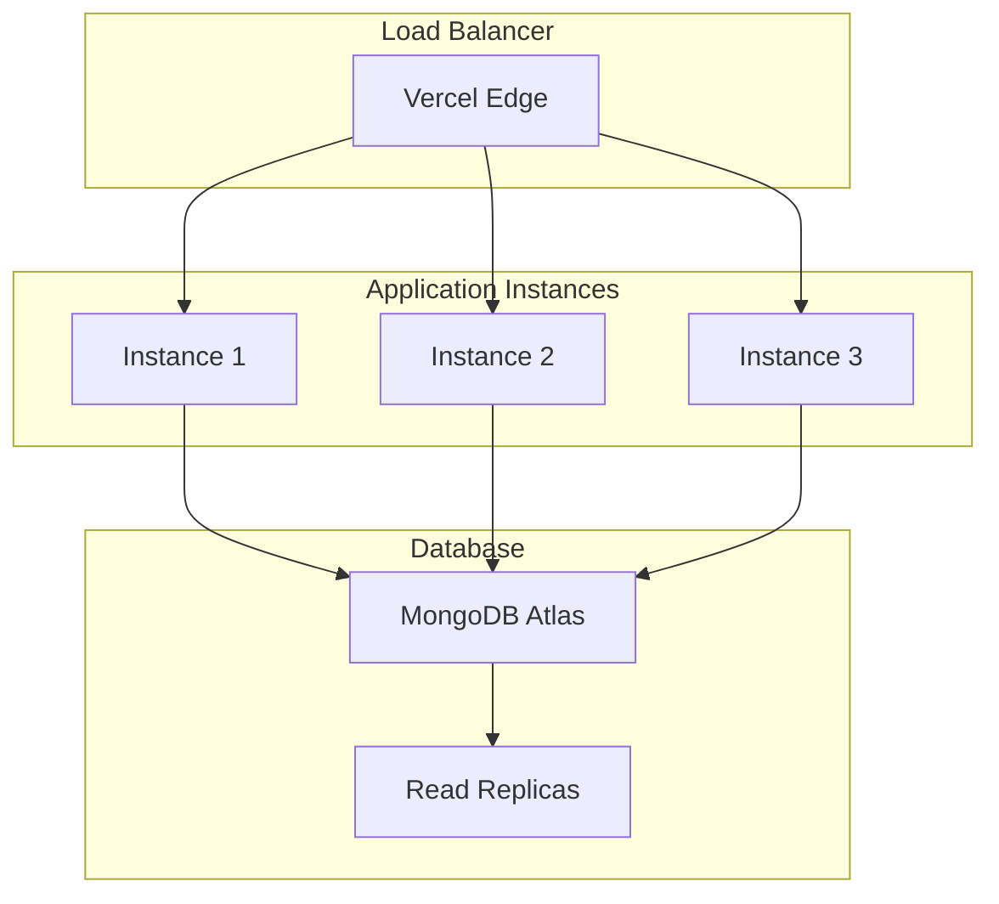

### Microservices Architecture (Future)

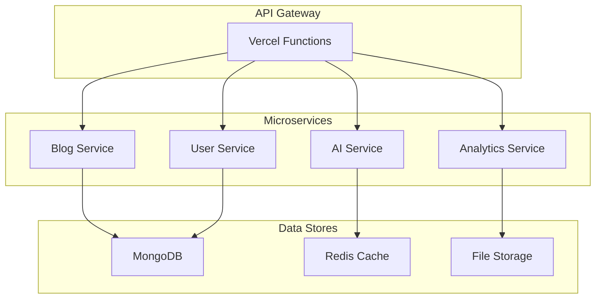

### Performance Optimization

```typescript
// Database connection pooling
const mongooseOptions = {
  maxPoolSize: 10,
  serverSelectionTimeoutMS: 5000,
  socketTimeoutMS: 45000,
  bufferCommands: false,
  bufferMaxEntries: 0
};

// Caching strategy
const cacheConfig = {
  redis: {
    host: process.env.REDIS_HOST,
    port: process.env.REDIS_PORT,
    ttl: 3600 // 1 hour
  },
  memory: {
    max: 100,
    ttl: 60000 // 1 minute
  }
};

// Rate limiting
const rateLimitConfig = {
  windowMs: 15 * 60 * 1000, // 15 minutes
  max: 100, // limit each IP to 100 requests per windowMs
  message: 'Too many requests from this IP'
};
```

---

## 🔄 Deployment Architecture

### CI/CD Pipeline

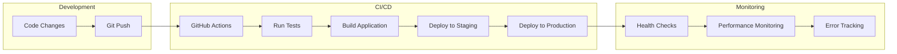

### Environment Architecture

```mermaid
graph TB
    subgraph "Environments"
        A[Development] --> B[Staging]
        B --> C[Production]
    end
    
    subgraph "Infrastructure"
        D[Vercel Platform]
        E[MongoDB Atlas]
        F[Google Cloud]
    end
    
    subgraph "Monitoring"
        G[Vercel Analytics]
        H[Sentry Error Tracking]
        I[Custom Metrics]
    end
    
    C --> D
    C --> E
    C --> F
    C --> G
    C --> H
    C --> I
```

---

<div align="center">

**Architecture Documentation for Gemini AI Blog** 🏗️

*Scalable, secure, and performant architecture*

</div> 