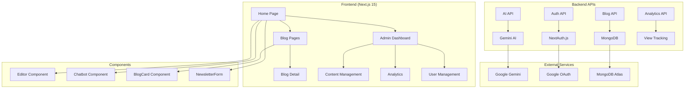
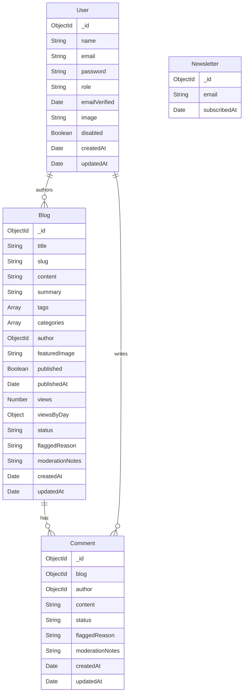
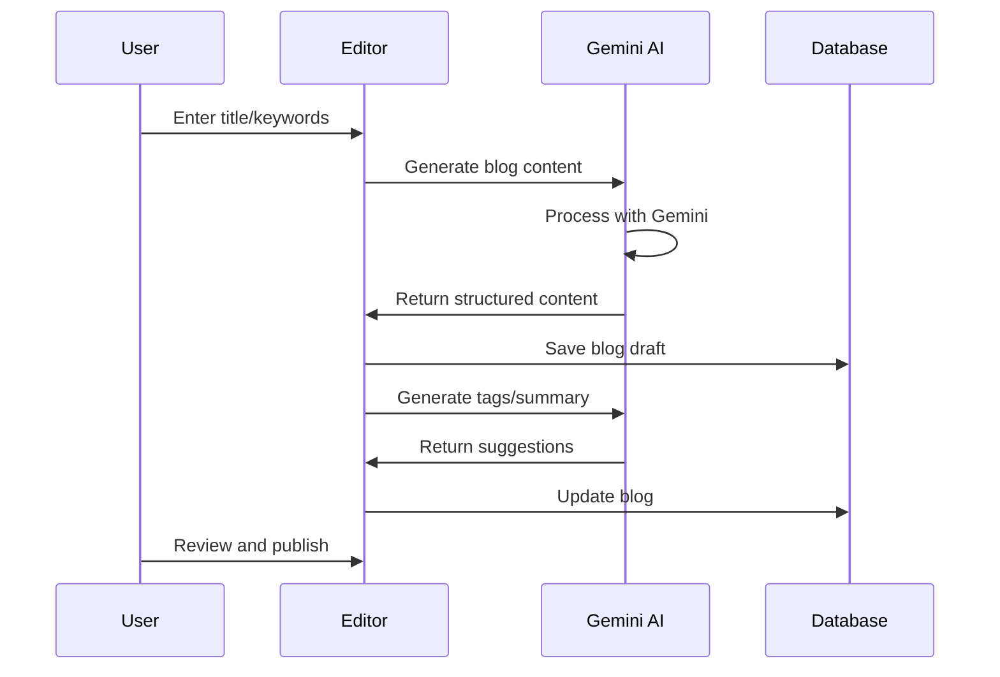
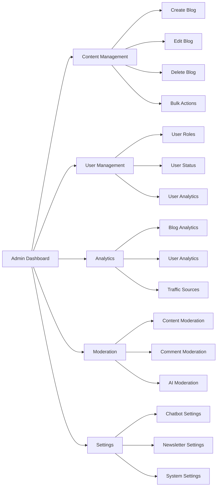
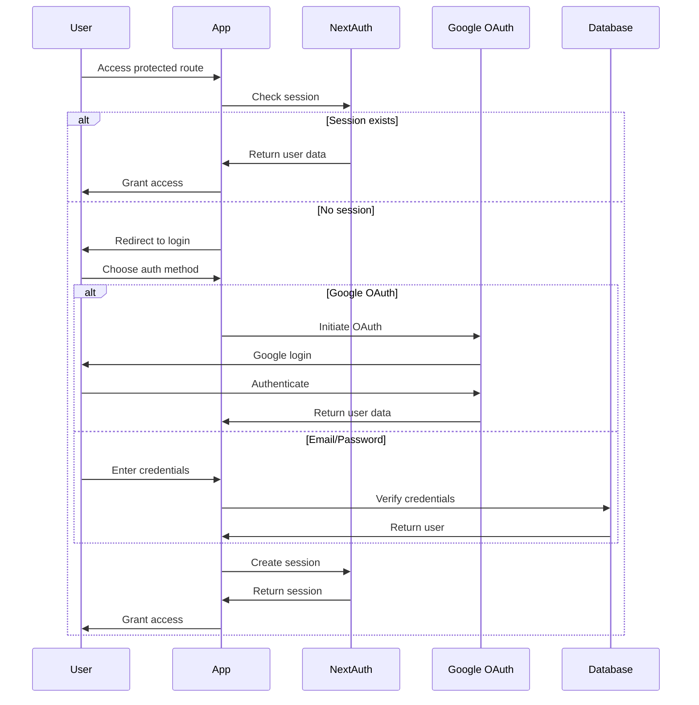
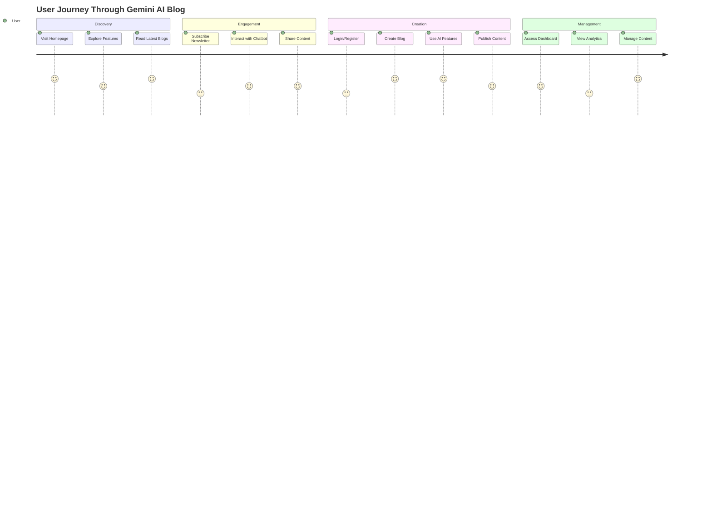
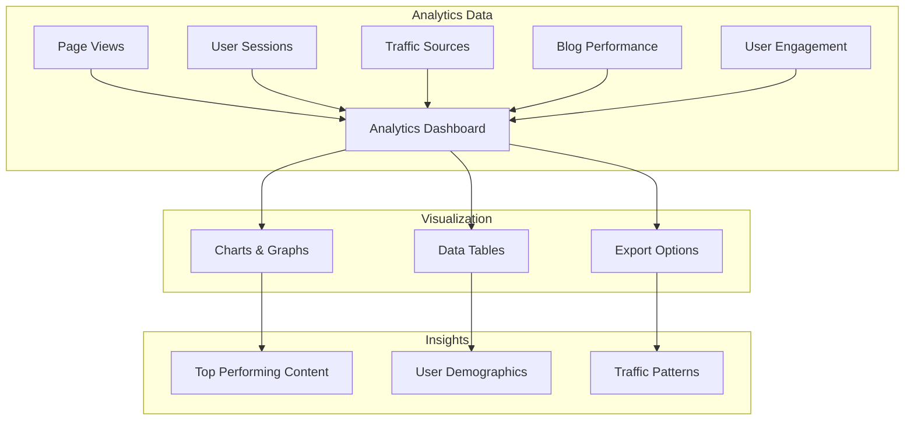

# 🤖 Gemini AI Blog - Complete Documentation

<div align="center">


**The most modern, AI-powered, SEO-optimized blogging platform powered by Google Gemini AI**

[🚀 Live Demo](#) • [📖 Documentation](#documentation) • [🛠️ Setup Guide](#quick-start) • [🤖 AI Features](#ai-powered-features)

</div>

---

## 📋 Table of Contents

- [🌟 Overview](#-overview)
- [🚀 Quick Start](#-quick-start)
- [🏗️ Architecture](#️-architecture)
- [🤖 AI-Powered Features](#ai-powered-features)
- [📊 Admin Dashboard](#-admin-dashboard)
- [🔐 Authentication & Security](#-authentication--security)
- [📱 User Experience](#-user-experience)
- [🔧 API Documentation](#-api-documentation)
- [📈 Analytics & SEO](#-analytics--seo)
- [🛠️ Development Guide](#️-development-guide)
- [🚀 Deployment](#-deployment)
- [🤝 Contributing](#-contributing)

---

## 🌟 Overview

Gemini AI Blog is a **next-generation blogging platform** that combines the power of **Google Gemini AI** with modern web technologies to create an intelligent, SEO-optimized content management system.

### ✨ Key Features

- 🤖 **AI-Powered Content Generation** - Create blogs with Gemini AI
- 📊 **Advanced Analytics Dashboard** - Track performance and insights
- 🔐 **Role-Based Access Control** - Admin, Editor, Reader roles
- 💬 **Live AI Chatbot** - Interactive assistance powered by Gemini
- 📱 **Responsive Design** - Mobile-first approach with dark mode
- 🚀 **SEO Optimization** - Automatic meta tags, sitemaps, structured data
- 📧 **Newsletter System** - Email subscription management
- 🛡️ **Content Moderation** - AI-powered content filtering

---

## 🚀 Quick Start

### Prerequisites

- Node.js 18+ 
- MongoDB Atlas account
- Google Gemini API key
- Google OAuth credentials (optional)

### Installation

```bash
# Clone the repository
git clone https://github.com/yourusername/gemini-ai-blog.git
cd gemini-ai-blog

# Install dependencies
npm install

# Set up environment variables
cp .env.example .env.local
```

### Environment Variables

```env
# Database
MONGODB_URI=your_mongodb_atlas_connection_string

# Authentication
NEXTAUTH_SECRET=your_nextauth_secret
NEXTAUTH_URL=http://localhost:3000

# Google OAuth (optional)
GOOGLE_CLIENT_ID=your_google_client_id
GOOGLE_CLIENT_SECRET=your_google_client_secret

# Gemini AI
GEMINI_API_KEY=your_gemini_api_key

# App Configuration
NEXT_PUBLIC_BASE_URL=http://localhost:3000
```

### Run Development Server

```bash
npm run dev
```

Open [http://localhost:3000](http://localhost:3000) to view the application.

---

## 🏗️ Architecture

### System Architecture Diagram



### Database Schema



---

## 🤖 AI-Powered Features

### Content Generation Flow



### AI Features Overview

| Feature | Description | API Endpoint |
|---------|-------------|--------------|
| **Blog Generation** | Create complete blog posts from titles/keywords | `/api/ai/generate-blog` |
| **Content Enhancement** | Suggest tags, summaries, alt text | `/api/ai/suggest-tags` |
| **Content Moderation** | AI-powered content filtering | `/api/ai/moderate` |
| **Live Chatbot** | Interactive AI assistance | `/api/ai/chat` |
| **Image Analysis** | Generate alt text for images | `/api/ai/alt-text` |
| **Content Summarization** | Create blog summaries | `/api/ai/summarize` |

### AI Integration Code Example

```typescript
// Blog generation with Gemini AI
async function generateBlog(title: string, keywords: string) {
  const prompt = `Generate a detailed, SEO-optimized blog post.
    Title: ${title}
    Keywords: ${keywords}
    Return JSON with fields: content (markdown), summary, tags (array), categories (array).`;
    
  const response = await fetch('https://generativelanguage.googleapis.com/v1beta/models/gemini-pro:generateContent?key=' + process.env.GEMINI_API_KEY, {
    method: 'POST',
    headers: { 'Content-Type': 'application/json' },
    body: JSON.stringify({ contents: [{ parts: [{ text: prompt }] }] }),
  });
  
  return response.json();
}
```

---

## 📊 Admin Dashboard

### Dashboard Structure



### Admin Features

#### 🎯 Content Management
- **Blog Editor**: Rich text editor with AI assistance
- **Bulk Operations**: Publish, delete multiple blogs
- **Draft System**: Auto-save and version control
- **Media Management**: Image upload and optimization

#### 👥 User Management
- **Role Assignment**: Admin, Editor, Reader roles
- **User Analytics**: Activity tracking and insights
- **Access Control**: Granular permissions
- **User Status**: Enable/disable accounts

#### 📈 Analytics Dashboard
- **Blog Performance**: Views, engagement metrics
- **User Analytics**: User behavior and patterns
- **Traffic Sources**: Referrer analysis
- **Real-time Data**: Live statistics

---

## 🔐 Authentication & Security

### Authentication Flow



### Security Features

- **JWT-based Sessions**: Secure token management
- **Role-Based Access**: Granular permissions
- **Password Hashing**: bcrypt encryption
- **CSRF Protection**: Built-in NextAuth protection
- **Rate Limiting**: API request throttling
- **Content Validation**: Input sanitization

---

## 📱 User Experience

### User Journey Flow



### UI/UX Features

#### 🎨 Design System
- **Modern Aesthetics**: Clean, professional design
- **Dark Mode**: Built-in theme support
- **Responsive Design**: Mobile-first approach
- **Smooth Animations**: Framer Motion integration
- **Accessibility**: WCAG compliant

#### 🚀 Performance
- **Server-Side Rendering**: Fast initial load
- **Image Optimization**: Automatic optimization
- **Code Splitting**: Lazy loading
- **Caching**: Intelligent caching strategies

---

## 🔧 API Documentation

### Core API Endpoints

#### Blog Management
```http
GET    /api/blog              # Get all published blogs
POST   /api/blog              # Create new blog
GET    /api/blog/[slug]       # Get specific blog
PUT    /api/blog/[slug]       # Update blog
DELETE /api/blog/[slug]       # Delete blog
PATCH  /api/blog/[slug]       # Partial update
```

#### Authentication
```http
GET    /api/auth/[...nextauth] # NextAuth endpoints
POST   /api/auth/register     # User registration
```

#### AI Services
```http
POST   /api/ai/generate-blog  # Generate blog content
POST   /api/ai/chat          # AI chatbot
POST   /api/ai/moderate      # Content moderation
POST   /api/ai/suggest-tags  # Tag suggestions
POST   /api/ai/summarize     # Content summarization
```

#### Admin Features
```http
GET    /api/admin/users       # Get all users
POST   /api/admin/users       # Update user
DELETE /api/admin/users       # Delete user
GET    /api/newsletter        # Get subscribers
POST   /api/newsletter        # Add subscriber
```

### API Response Format

```typescript
// Success Response
{
  "success": true,
  "data": {
    // Response data
  },
  "message": "Operation successful"
}

// Error Response
{
  "success": false,
  "error": "Error message",
  "code": "ERROR_CODE"
}
```

---

## 📈 Analytics & SEO

### SEO Features

#### 🔍 Search Engine Optimization
- **Meta Tags**: Dynamic Open Graph and Twitter cards
- **Structured Data**: JSON-LD schema markup
- **Sitemap**: Automatic XML sitemap generation
- **Robots.txt**: Search engine directives
- **Canonical URLs**: Duplicate content prevention

#### 📊 Analytics Integration
- **Google Analytics 4**: Traffic tracking
- **View Analytics**: Blog performance metrics
- **User Behavior**: Engagement tracking
- **Conversion Tracking**: Newsletter signups

### Analytics Dashboard



---

## 🛠️ Development Guide

### Project Structure

```
src/
├── app/                    # Next.js App Router
│   ├── (admin)/           # Admin route group
│   │   └── dashboard/     # Admin dashboard pages
│   ├── (auth)/            # Authentication routes
│   ├── (blog)/            # Public blog routes
│   └── api/               # API endpoints
│       ├── ai/            # AI-related APIs
│       ├── auth/          # Authentication APIs
│       ├── blog/          # Blog CRUD APIs
│       └── admin/         # Admin-specific APIs
├── components/            # Reusable UI components
├── lib/                   # Utility libraries
├── models/                # MongoDB schemas
└── middleware.ts          # Next.js middleware
```

### Development Commands

```bash
# Development
npm run dev              # Start development server
npm run build            # Build for production
npm run start            # Start production server
npm run lint             # Run ESLint

# Database
npm run db:seed          # Seed database with sample data
npm run db:reset         # Reset database

# Testing
npm run test             # Run tests
npm run test:watch       # Run tests in watch mode
```

### Code Quality

- **TypeScript**: Strict type checking
- **ESLint**: Code linting and formatting
- **Prettier**: Code formatting
- **Husky**: Git hooks for quality checks

---

## 🚀 Deployment

### Production Deployment

#### Vercel (Recommended)
```bash
# Install Vercel CLI
npm i -g vercel

# Deploy
vercel --prod
```

#### Docker Deployment
```dockerfile
# Dockerfile
FROM node:18-alpine
WORKDIR /app
COPY package*.json ./
RUN npm ci --only=production
COPY . .
RUN npm run build
EXPOSE 3000
CMD ["npm", "start"]
```

#### Environment Setup
```env
# Production Environment Variables
NODE_ENV=production
MONGODB_URI=your_production_mongodb_uri
NEXTAUTH_SECRET=your_production_secret
NEXTAUTH_URL=https://yourdomain.com
GEMINI_API_KEY=your_gemini_api_key
NEXT_PUBLIC_BASE_URL=https://yourdomain.com
```

### Performance Optimization

- **CDN**: Content delivery network
- **Caching**: Redis for session storage
- **Database**: MongoDB Atlas optimization
- **Images**: Cloudinary integration
- **Monitoring**: Error tracking and analytics

---

## 🤝 Contributing

We welcome contributions! Please see our [Contributing Guide](CONTRIBUTING.md) for details.

### Development Setup

1. Fork the repository
2. Create a feature branch
3. Make your changes
4. Add tests
5. Submit a pull request

### Code Standards

- Follow TypeScript best practices
- Use meaningful commit messages
- Add documentation for new features
- Ensure all tests pass

---

## 📄 License

This project is licensed under the MIT License - see the [LICENSE](LICENSE) file for details.

---

## 🙏 Acknowledgments

- **Google Gemini AI** for powerful AI capabilities
- **Next.js Team** for the amazing framework
- **Vercel** for deployment platform
- **MongoDB** for database solution
- **Tailwind CSS** for styling framework

---

<div align="center">

**Made with ❤️ and 🤖 AI**

[Report Bug](https://github.com/yourusername/gemini-ai-blog/issues) • [Request Feature](https://github.com/yourusername/gemini-ai-blog/issues) • [Star Repository](https://github.com/yourusername/gemini-ai-blog)

</div>
