# 🤖 TechUpdatesZone Blog

<div align="center">


**An end-to-end, AI-native publishing platform with admin tooling, analytics, and multi-channel deployment.**

[Live Demo](#) • [Start Building](#-getting-started) • [API Reference](#-api-reference) • [Deployment](#-deployment--operations)

</div>

---

## 📚 Why This README?

This document serves as the single source of truth for the project, covering:

- Product & feature overview
- Architecture and data contracts
- Local development + environment setup
- API reference
- User/admin workflows & AI usage
- Deployment, security, monitoring, and troubleshooting

---

## 🧭 Table of Contents

1. [Overview & Feature Set](#-overview--feature-set)
2. [Architecture & Stack](#-architecture--stack)
3. [Project Structure](#-project-structure)
4. [Getting Started](#-getting-started)
5. [Configuration](#-configuration)
6. [Run & Test Commands](#-run--test-commands)
7. [API Reference](#-api-reference)
8. [User & Admin Guide](#-user--admin-guide)
9. [AI Capabilities](#-ai-capabilities)
10. [Deployment & Operations](#-deployment--operations)
11. [Security & Compliance](#-security--compliance)
12. [Monitoring & Troubleshooting](#-monitoring--troubleshooting)
13. [Contributing & License](#-contributing--license)

---

## 🌟 Overview & Feature Set

- **AI-native authoring:** Gemini-powered generation, summaries, tags, alt text, moderation, and chatbot.
- **Full CMS:** Drafts, publishing, featured media (Cloudinary), custom comments system, newsletter capture.
- **Admin Dashboard:** Comprehensive analytics (visitors, views), user management, blog management, and settings.
- **Role-based control:** Admin/editor/reader roles with toggleable user states.
- **Modern UX:** Next.js 15 App Router, responsive UI, dark mode, Tailwind 4 + Framer Motion animations.
- **Enterprise-ready:** NextAuth (Google + Credentials), visitor tracking, issue reporting system.

---

## 🏗️ Architecture & Stack

```mermaid
graph TB
    subgraph Clients
        A["Public Web"]
        B["Admin Dashboard"]
        C["AI Chatbot Widget"]
    end

    subgraph "Next.js App"
        D["App Router Pages"]
        E["Shared Components"]
        F["API Routes (App Router)"]
        G["Real-time Notifications (App Router)"]
    end

    subgraph "Core Services"
        H["Auth · NextAuth"]
        I["Content Services"]
        J["AI Service Layer"]
        K["Analytics Engine"]
    end

    subgraph "Data Stores"
        L["MongoDB Atlas"]
        M["Cloudinary (Images)"]
    end

    subgraph "External Providers"
        N["Google Gemini"]
        O["Google OAuth"]
    end

    A --> D
    B --> D
    C --> E
    D --> F --> I --> L
    F --> H --> O
    F --> J --> N
    F --> M
```



### Layer Responsibilities
- **Presentation:** `src/app`, `src/components` for layouts, route groups, reusable UI.
- **Application:** `src/app/api`, authentication, validation, and orchestrations.
- **Business Logic:** API route handlers invoking services (blogs, users, newsletter, analytics).
- **Data Access:** `src/models`, `src/lib/mongodb*.ts` for schemas and connections.
- **External Integrations:** Gemini AI, Google OAuth, Cloudinary.

### Technology Stack

| Layer | Technologies |
|-------|--------------|
| Frontend | Next.js 15.4 (App Router), React 19, TypeScript, Tailwind CSS 4, Framer Motion |
| Backend | Node.js, Next.js API Routes, NextAuth, Mongoose |
| Database | MongoDB Atlas |
| Storage | Cloudinary (Image Uploads) |
| AI | Google Gemini (generation, moderation, summarization, chatbot, alt text) |
| Tooling | ESLint, Prettier |

---

## 📂 Project Structure

```
├── src/
│   ├── app/                 # App Router: Public, admin, auth, API routes
│   │   ├── (admin)/         # Admin dashboard routes
│   │   ├── (auth)/          # Authentication pages
│   │   ├── (blog)/          # Public blog pages
│   │   ├── api/             # Backend API endpoints
│   │   ├── setup/           # Initial setup page
│   │   └── ...
│   ├── components/          # Reusable UI components (AdminBlogEditor, Chatbot, etc.)
│   ├── lib/                 # Utilities: Auth options, MongoDB connection
│   ├── models/              # Mongoose Schemas: Blog, User, Comment, Settings, etc.
│   └── middleware.ts        # Middleware configuration
├── pages/
│   └── api/                 # API Routes
├── public/                  # Static assets
├── package.json             # npm scripts + deps
└── README.md                # Project documentation
```

---

## 🚀 Getting Started

### Prerequisites
- Node.js **18+**
- npm **10+**
- MongoDB Atlas cluster (or local Mongo)
- Google Gemini API key
- Cloudinary Account
- Google OAuth Credentials (optional)

### Bootstrap

1. **Clone the repository:**
   ```bash
   git clone https://github.com/yourusername/gemini-ai-blog.git
   cd gemini-ai-blog
   ```

2. **Install dependencies:**
   ```bash
   npm install
   ```

3. **Configure Environment:**
   Create a `.env.local` file in the root directory and add the following variables:

   ```env
   # Database
   MONGODB_URI=mongodb+srv://<username>:<password>@cluster.mongodb.net/blog

   # Authentication
   NEXTAUTH_SECRET=your_super_secret_key
   NEXTAUTH_URL=http://localhost:3000
   NEXT_PUBLIC_BASE_URL=http://localhost:3000

   # Google OAuth (Optional)
   GOOGLE_CLIENT_ID=your_google_client_id
   GOOGLE_CLIENT_SECRET=your_google_client_secret

   # AI
   GEMINI_API_KEY=your_gemini_api_key

   # Image Upload (Cloudinary)
   CLOUDINARY_CLOUD_NAME=your_cloud_name
   CLOUDINARY_API_KEY=your_api_key
   CLOUDINARY_API_SECRET=your_api_secret

   # Initial Admin Setup (Optional defaults)
   ADMIN_EMAIL=admin@in.com
   ADMIN_PASSWORD=admin
   ADMIN_NAME=Admin
   ```

4. **Run the application:**
   ```bash
   npm run dev
   ```

5. **Initial Setup:**
   - Visit `http://localhost:3000/setup` to create your first admin account if you haven't set one up via env vars or seeding.
   - Visit `http://localhost:3000/admin` to access the dashboard.

---

## 🧪 Run & Test Commands

```bash
npm run dev          # Development server
npm run build        # Production build
npm run start        # Serve production build
npm run lint         # ESLint
```

---

## 📡 API Reference

> Base path: `/src/app/api`

### Authentication
| Endpoint | Method | Description |
|----------|--------|-------------|
| `/api/auth/[...nextauth]` | GET/POST | NextAuth provider router |
| `/api/setup` | POST | Create initial admin user |

### Blog & Content
| Endpoint | Method | Description |
|----------|--------|-------------|
| `/api/blog` | GET/POST | List blogs / Create blog |
| `/api/blog/[slug]` | GET/PUT/DELETE | Get, Update, Delete blog |
| `/api/upload-image` | POST | Upload image to Cloudinary |

### AI Services
| Endpoint | Purpose | Payload |
|----------|---------|---------|
| `/api/ai/generate-blog` | Full draft generation | `{ title, keywords? }` |
| `/api/ai/summarize` | Summary | `{ content, maxLength? }` |
| `/api/ai/suggest-tags` | Tags/categories | `{ content, title? }` |
| `/api/ai/alt-text` | Image accessibility | `{ imageUrl }` |
| `/api/ai/moderate` | Content moderation | `{ content }` |
| `/api/ai/chat` | Conversational chatbot | `{ messages }` |

### User & Admin APIs
| Endpoint | Method | Description |
|----------|--------|-------------|
| `/api/admin/users` | GET/POST/DELETE | Manage users |
| `/api/admin/analytics` | GET | Dashboard KPIs |
| `/api/newsletter` | GET/POST | Subscribe / List subscribers |
| `/api/comments` | GET/POST | Public comments |
| `/api/visitors` | POST | Track visitor sessions |
| `/api/issues` | POST | Report issues |

---

## 👩‍💻 User & Admin Guide

### Getting Started
1. **Setup:** Use `/setup` to create your admin account.
2. **Login:** Access `/admin` and log in with your credentials.
3. **Dashboard:** View analytics, manage content, and configure settings.

### Writing & Publishing
1. Navigate to `Dashboard → Blogs → Create`.
2. Enter a title and use **Generate with AI** to create a draft.
3. Upload a featured image (handled by Cloudinary).
4. Use the Markdown editor to refine content.
5. Publish or save as draft.

### Admin Features
- **Analytics:** Track views, visitors, and engagement.
- **User Management:** Manage roles (Admin, Editor, Reader) and access.
- **Newsletter:** View and manage subscribers.
- **Settings:** Configure site metadata and chatbot behavior.

### AI Chatbot
- Available on public pages.
- Powered by Gemini to answer questions based on context.

---

## 🤖 AI Capabilities

The platform leverages Google Gemini for:
- **Content Generation:** Creates structured blog posts from titles/keywords.
- **Moderation:** Automatically checks content for safety before publishing.
- **Accessibility:** Generates alt text for uploaded images.
- **Engagement:** Chatbot for visitor interaction.

---

## 🚢 Deployment

### Vercel (Recommended)
1. Push your code to a GitHub repository.
2. Import the project into Vercel.
3. Add all environment variables from `.env.local`.
4. Deploy.

### Docker
(Standard Next.js Dockerfile structure applies)

---

## 🛡️ Security

- **Authentication:** Secure sessions via NextAuth.
- **Authorization:** Role-based access control for Admin routes.
- **Data Safety:** Inputs sanitized; passwords hashed.
- **Rate Limiting:** Implemented via custom logic or external providers (e.g., Vercel).

---

## 🤝 Contributing

1. Fork the repository.
2. Create a feature branch.
3. Commit your changes.
4. Push to the branch.
5. Open a Pull Request.

---

<div align="center">

**Built with Next.js 15, Tailwind 4, and Google Gemini AI.**

</div>

